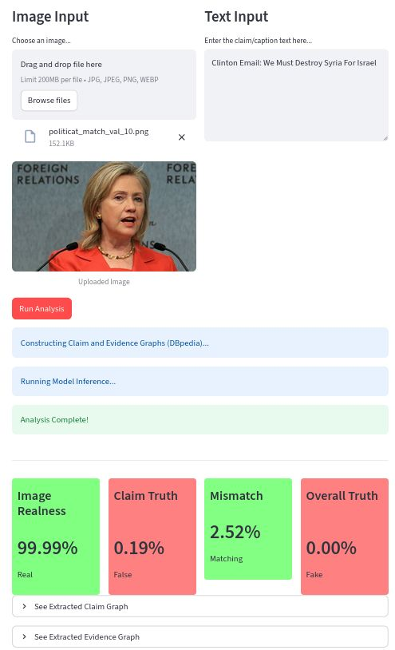

# Disentangling Visual, Semantic, and Factual Deception

**A Multi-Branch Approach to Misinformation Detection**

This repository contains the implementation of the manuscript *"Disentangling Visual, Semantic, and Factual Deception: A Multi-Branch Approach to Misinformation Detection"*.

## Project Overview

The rapid dissemination of misinformation on social media, particularly through the manipulation of image-text contexts, poses a significant challenge to digital forensics. This project presents a novel multimodal architecture for detecting such misinformation by explicitly modeling the consistency between visual content, textual claims, and external factual knowledge.

**Key Features:**
*   **Deepfake Detection Branch**: Assesses visual authenticity using a fine-tuned vision transformer (Deepfake Detector).
*   **Text-Image Consistency Branch**: Leverages CLIP to measure semantic alignment between text and images.
*   **Encyclopedic Branch**: A novel module that grounds textual claims in Knowledge Graphs (KGs) constructed dynamically from DBpedia, avoiding the noise of open-web search.

The system outputs predictions for:
1.  **Factual Claim Veracity** (Is the text claim factually true?)
2.  **Visual Authenticity** (Is the image real or manipulated?)
3.  **Cross-Modal Mismatch** (Does the image support the text?)
4.  **Overall Truthfulness** (Is the post as a whole true?)


<figure>
  
  <figcaption>
    Figure 1: Overview of the proposed multi-branch architecture combining visual, semantic, and factual deception detection modules.
  </figcaption>
</figure>


<figure>
  
  <figcaption>
    Figure 2: Conversion process of textual claims into claim graph and evidence graph using DBpedia.
  </figcaption>
</figure>


## Results

Performance of the Global architecture on MMFakeBench and COSMOS datasets (Table 4 from manuscript).

| Train-Test Data Set | Neuron | Accuracy | F1 | Precision | Recall |
| :--- | :--- | :--- | :--- | :--- | :--- |
| **MMFakeBench-Val** | (1) Factual Claim | 0.927 | 0.941 | 0.950 | 0.931 |
| | (2) Real Image | 0.982 | 0.987 | 0.983 | 0.992 |
| | (3) Mismatch | 0.823 | 0.718 | 0.740 | 0.698 |
| | (3) Overall Truth | 0.829 | 0.659 | 0.659 | 0.659 |
| **MMFakeBench-Test** | (1) Factual Claim | **0.983** | **0.988** | **0.986** | **0.990** |
| | (2) Real Image | **0.992** | **0.995** | **0.994** | **0.995** |
| | (3) Mismatch | 0.822 | 0.734 | 0.693 | 0.780 |
| | (4) Overall Truth | 0.817 | 0.680 | 0.730 | 0.636 |
| **MMFakeBench** | (1) Factual Claim | 0.926 | 0.946 | 0.919 | 0.974 |
| | (2) Image Real | 0.984 | 0.989 | 0.982 | **0.997** |
| | (3) Mismatch | 0.788 | 0.668 | 0.643 | 0.694 |
| | (4) Overall Truth | 0.797 | 0.647 | 0.667 | 0.628 |
| **COSMOS-Test** | (3) Mismatch | **0.948** | **0.947** | **0.947** | **0.947** |

## Project Organization

```
├── LICENSE            
├── Makefile           
├── README.md          
├── data
│   ├── external       
│   │      ├── MMFakeBench              <- Raw test/val data from MMFakeBench renamed in train/test resp.
│   │      └── cosmos                   <- Raw COSMOS test json
│   ├── processed      
│   │      ├── MMFakeBench_graphs              <- Data for MMFFakeBench train/test/val framework
│   │      ├── MMFakeBenchOriginal_graphs      <- Data for the original MMFFakeBench test/val split
│   │      ├── MMFakeBench_graphs_stratisfied <- Data for stratified sampling experiments
│   │      ├── cosmos_formatted                <- COSMOS data set with common labeling and formatting
│   │      └── cosmos_graphs                   <- Data for COSMOS experiments
│
├── docs               
│
├── models                        
│
├── notebooks          
│
├── app                           <- Demo app
│
├── app_dev                       <- App for figures and evaluation results
│
├── pyproject.toml     
│
├── reports            
│   └── figures        
│
├── requirements.txt   
│
├── setup.cfg          
│
├── src
│
├── tests
│
└── corpus_truth_manipulation   
    │
    ├── config.py               
    └── dataset.py              
```

## Setup

### Environment

1.  Ensure you have **Python ~3.12** installed.
2.  Install dependencies and download necessary models (e.g., spaCy) using the provided script:

```bash
chmod +x install.sh
./install.sh
```

### Configuration (.env)

This project uses `python-dotenv` to manage environment variables. Create a `.env` file in the project root to store sensitive configuration or overrides.

```bash
touch .env
```

Example `.env` content (wandb optional, depending on your usage):

```dotenv
HF_TOKEN=your_huggingface_token

# Optional: Weights & Biases API Key for experiment tracking
WANDB_API_KEY=your_wandb_key
WANDB_ENTITY=your_wandb_entity
```

## Data Preparation

The project relies on [MMFakeBench](https://github.com/liuxuannan/MMFakeBench) and [COSMOS](https://shivangi-aneja.github.io/projects/cosmos/) datasets. The following commands handle formatting and graph construction.
Download the raw datasets and place them in the appropriate folders under `data/external/` as indicated in the project organization.

We already provide in this repo the processed train/test split for MMFakeBench-Val split in `data/processed/MMFakeBenchOriginal_graphs/`.
**It is still needed to download the raw MMFakeBench data, in `data/external`, for the images.**

For other splits: 

### COSMOS Dataset

Format raw COSMOS data and build DBpedia graphs:

```bash
poetry run python src/data/process_cosmos.py --split test
poetry run python -m src.data.build_dbpedia_database --split test --dataset-folder COSMOS
```

### MMFakeBench Dataset

Process MMFakeBench data, build knowledge graphs, and reorganize splits:

```bash
# Build graphs for all splits
poetry run python -m src.data.build_dbpedia_database --split train --dataset-folder MMFAKEBENCH
poetry run python -m src.data.build_dbpedia_database --split val --dataset-folder MMFAKEBENCH
poetry run python -m src.data.build_dbpedia_database --split test --dataset-folder MMFAKEBENCH

# Reorganize into original splits
poetry run python src/data/reorganize_mmfakebench.py

# Stratified Sampling for experiments
poetry run python -m src.data.stratified_sampling_mmfakebench
```

### Other

Attemps to use the [XFACTA](https://github.com/neu-vi/XFacta) dataset are visible in the codebase, but were not fully integrated due to misconfigurations in the dataset.

## Training

Models can be trained using the provided SLURM scripts (for HPC environments) or locally via `poetry`.

Train ablation study (Global + 14 variants).
Using SLURM:
```bash
sbatch hpc/train_ablation.slurm --dataset MMFAKEBENCH_val_original --no-use-validation-set
```

**Example: Train Global model on MMFakeBench-Val (original split)**

Using Poetry (Locally):
```bash
poetry run python -m src.train_mmmd \
    --n-trials 1 \
    --device gpu \
    --split train \
    --wandblog \
    --no-use-optuna-params "" "optuna-study-name" \
    --jobid "LOCAL_JOB" \
    --dataset MMFAKEBENCH_val_original \
    --no-use-validation-set
```

## Saved model

A trained model checkpoint for the Global architecture on MMFakeBench-Test train sub-split is [available on HuggingFace](https://huggingface.co/4l3x4ndre/multimodal-misinformation-detector/).
This model is automatically downloaded when using the demo application in `app/`.

## Evaluation / Testing

To test the trained models on the MMFakeBench-Val set, use the following command:

```bash
# Test ablation study models on MMFakeBench-Val set
sbatch hpc/test_ablation.slurm --dataset MMFAKEBENCH_val_original
```
This will train all 14 ablation models and the Global model on the MMFakeBench-Val set.

To test the model checkpoint provided on HuggingFace on the test sub-split of MMFakeBench-Val:

```bash
poetry run python -m src.test_mmmd \
    --checkpoint "models/global_trained-MMFakeBenchTest.pt/
    --studyname "test_mmfakebench-val" \
    --ablationname "global_model" \
    --jobid "0" \
    --device gpu \
    --dataset_folder MMFAKEBENCH_val_original 
```

**Testing one model variant on COSMOS (Example):**

```bash
sbatch hpc/test_global.slurm \
    --checkpoint <path_to_model_checkpoint> \
    --device "cuda:0" \
    --studyname "test_cosmos" \
    --ablationname full \
    --dataset_folder COSMOS
```

## Demo Application

A Streamlit-based interactive demo is available to visualize the model's predictions on custom images and text.

**Usage:**

```bash
poetry run streamlit run app/Home.py
```

<figure>
  
  <figcaption>
    Figure 3: Screenshot of the demo application interface.
  </figcaption>

## References

*   EGMMG pipeline: **Duwal, S., Shopnil, M. N. S., Tyagi, A., & Proma, A. M. (2025). *Evidence-Grounded Multimodal Misinformation Detection with Attention-Based GNNs*. arXiv. [https://doi.org/10.48550/arXiv.2505.18221](https://doi.org/10.48550/arXiv.2505.18221)**
*   DeepFakeDetector on [HuggingFace](https://huggingface.co/prithivMLmods/deepfake-detector-model-v1)
*   COSMOS: Aneja, S., Bregler, C., & Nießner, M. (2021). *COSMOS: Catching Out-of-Context Misinformation with Self-Supervised Learning*. arXiv. [https://doi.org/10.48550/ARXIV.2101.06278](https://doi.org/10.48550/ARXIV.2101.06278)
*   MMFakeBench: **Liu, X., Li, Z., Li, P., Huang, H., Xia, S., Cui, X., Huang, L., Deng, W., & He, Z. (2024). *MMFakeBench: A Mixed-Source Multimodal Misinformation Detection Benchmark for LVLMs*. arXiv. [https://doi.org/10.48550/arXiv.2406.08772](https://doi.org/10.48550/arXiv.2406.08772)**

*   Knowledge Base: [DBpedia](https://www.dbpedia.org/).
*   OpenAI-CLIP:  **Radford, A., Kim, J. W., Hallacy, C., Ramesh, A., Goh, G., Agarwal, S., Sastry, G., Askell, A., Mishkin, P., Clark, J., Krueger, G., & Sutskever, I. (2021). *Learning Transferable Visual Models From Natural Language Supervision*. arXiv. [https://doi.org/10.48550/arXiv.2103.00020](https://doi.org/10.48550/arXiv.2103.00020)**

